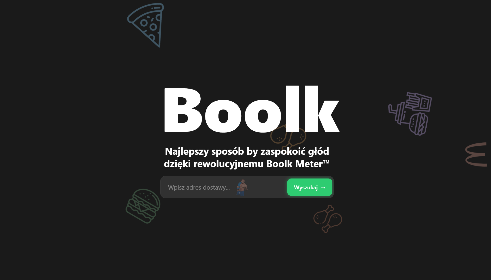

# Boolk

<!-- Screenshot -->

## Overview
**Boolk** is a mobile application that analyzes restaurant reviews using Gemini to generate ratings based on serving size and price. It helps students discover affordable dining options. The app was created during Software Mansion Hackathon 2025 and won public vote.

Built using React Native, Expo, TypeScript, and the Google Gemini API.
